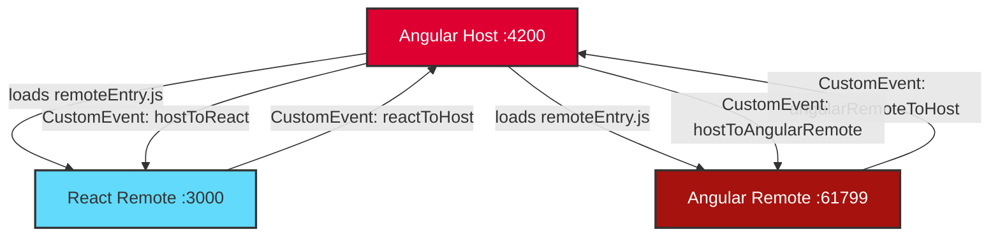

# 🚀 Angular ↔ React Micro-Frontends with Module Federation


> **Production-grade micro-frontend architecture** demonstrating runtime integration of Angular and React applications using Webpack 5 Module Federation. This project showcases how different teams can work independently while seamlessly integrating their applications at runtime.

## 🎯 Why This Matters

This isn't just another Todo app. This project demonstrates:

- ✅ **Cross-Framework Integration** - Angular host consuming both React and Angular remotes
- ✅ **True Micro-Frontend Architecture** - Independent development, deployment, and runtime integration
- ✅ **Component-Based Module Federation** - Dynamic script loading without iframes
- ✅ **Bidirectional Communication** - CustomEvents for cross-framework messaging
- ✅ **Web Components** - Angular remotes exposed as custom elements using @angular/elements
- ✅ **Production-Ready Patterns** - Error handling, CORS configuration, shared dependencies

## 📐 Architecture



### Project Structure

```
📦 module-federation/
├── 📂 angular-host/client/          # 🟢 Angular Host (Port 4200)
│   ├── src/app/
│   │   ├── react-wrapper.component.ts      # Loads React remote
│   │   ├── angular-wrapper.component.ts    # Loads Angular remote
│   │   └── home/home.component.ts          # Side-by-side display
│   └── webpack.config.js                    # Webpack MF config
│
├── 📂 react/                   # 🔵 React Remote (Port 3000)
│   ├── src/
│   │   ├── App.js              # React remote component
│   │   └── bootstrap.js        # Module Federation bootstrap
│   └── webpack.config.js       # Exposes React components
│
└── 📂 angular-remote/client/  # 🔴 Angular Remote (Port 61799)
    ├── src/app/
    │   ├── remote.component.ts           # Remote component
    │   ├── remote-bootstrap.ts           # Web Component bootstrap
    │   └── remote-routing.module.ts      # Route-based MF (optional)
    └── webpack.config.js                 # Exposes Angular components
```

### Port Configuration

| Application | Port | URL |
|-------------|------|-----|
| 🟢 Angular Host | 4200 | http://localhost:4200 |
| 🔵 React Remote | 3000 | http://localhost:3000 |
| 🔴 Angular Remote | 61799 | http://localhost:61799 |

## 🚀 Quick Start

### Prerequisites

- Node.js 18+ 
- npm 9+

### Installation & Running

```bash
# Clone the repository
git clone https://github.com/Asafabekasis/Module-federation-setup-Angular-React.git
cd Module-federation-setup-Angular-React

# Install dependencies for all apps
cd angular-host/client && npm install && cd ../..
cd react && npm install && cd ../..
cd "angular-remote/client" && npm install && cd ../..

# Start all applications (requires 3 terminals)

# Terminal 1 - Angular Host (Port 4200)
cd angular-host/client
ng serve
# Running at http://localhost:4200

# Terminal 2 - React Remote (Port 3000)
cd react
npm start
# Running at http://localhost:3000

# Terminal 3 - Angular Remote (Port 61799)
cd "angular-remote/client"
ng serve
# Running at http://localhost:61799

# Open http://localhost:4200 in your browser to view the host application
```

### Using Concurrently (Optional)

```bash
# Install concurrently globally
npm install -g concurrently

# Run all apps at once (from root)
concurrently "cd angular-host/client && ng serve" "cd react && npm start" "cd 'angular-remote/client' && ng serve"
```

## 💡 Key Features

### 1. Dynamic Remote Loading
Each remote is loaded at runtime via `remoteEntry.js`, allowing independent deployments:

```typescript
// React Remote - Dynamic Script Loading
const script = document.createElement('script');
script.src = 'http://localhost:3000/remoteEntry.js';
document.head.appendChild(script);

// Access exposed module
const container = window.reactApp;
const factory = await container.get('./App');
const ReactComponent = factory();
```

### 2. Cross-Framework Communication
CustomEvents enable seamless messaging between Angular and React:

```typescript
// Host → React
window.dispatchEvent(new CustomEvent('hostToReact', { 
  detail: message 
}));

// React → Host
window.addEventListener('reactToHost', (event) => {
  console.log(event.detail);
});
```

### 3. Angular Web Components
Angular remotes use `@angular/elements` to expose components as web components:

```typescript
import { createCustomElement } from '@angular/elements';

const RemoteElement = createCustomElement(RemoteComponent, { 
  injector: app.injector 
});
customElements.define('app-remote-element', RemoteElement);
```

### 4. Shared Dependencies Strategy

```javascript
// webpack.config.js
shared: {
  "@angular/core": { singleton: true, strictVersion: false },
  "react": { singleton: true },
  "react-dom": { singleton: true }
}
```

## 🎨 Screenshots

### Home Dashboard - Side-by-Side Remotes
*Both React and Angular remotes displayed simultaneously with bidirectional communication*


**Key Features Shown:**
- 🔵 React Remote (Port 3000) - Left side with cyan styling
- 🔴 Angular Remote (Port 61799) - Right side with purple styling
- 📨 Message inputs for sending data to each remote
- 📬 Real-time message display from remotes to host
- 🔄 Bidirectional communication via CustomEvents

### Route-Based Loading
*Full-page remote via `/angular-children` route*


## 🔧 Technical Highlights

### Module Federation Configuration

**React Remote (webpack.config.js)**
```javascript
new ModuleFederationPlugin({
  name: "reactApp",
  filename: "remoteEntry.js",
  exposes: {
    './App': './src/App',
    './react': 'react',
    './react-dom/client': 'react-dom/client'
  }
})
```

**Angular Remote (webpack.config.js)**
```javascript
new ModuleFederationPlugin({
  name: "angularRemote",
  filename: "remoteEntry.js",
  exposes: {
    './RemoteComponent': './src/app/remote-bootstrap.ts',
    './RemoteModule': './src/app/remote-routing.module.ts'
  }
})
```

### Error Handling & Fallback

```typescript
try {
  const factory = await container.get('./App');
  // Load component
} catch (error) {
  // Display fallback UI
  this.container.nativeElement.innerHTML = `
    <div class="error-message">
      ⚠️ Remote Not Available
    </div>
  `;
}
```

### CORS Configuration

```javascript
// Dynamic origin-based CORS headers
devServer: {
  setupMiddlewares: (middlewares, devServer) => {
    devServer.app.use((req, res, next) => {
      const origin = req.headers.origin;
      const allowedOrigins = ['http://localhost:4200', ...];
      
      if (origin && allowedOrigins.includes(origin)) {
        res.setHeader('Access-Control-Allow-Origin', origin);
      }
      next();
    });
    return middlewares;
  }
}
```

## 📚 Use Cases

This architecture is ideal for:

- **Enterprise Portals** - Multiple teams contributing widgets/sections
- **Gradual Migration** - Migrating from Angular to React (or vice versa) incrementally
- **Multi-Team Development** - Independent development and deployment cycles
- **Plugin Systems** - Third-party integrations displayed together
- **Dashboard Applications** - Multiple data sources in unified view

## 🛠️ Technology Stack

| Technology | Version | Purpose |
|------------|---------|---------|
| Angular | 19.2.x | Host application & Remote |
| React | 18.2.x | Remote application |
| Webpack | 5.x | Module Federation |
| TypeScript | 5.x | Type safety |
| @angular/elements | 19.x | Web Components |
| @angular-architects/module-federation | 20.x | MF helpers |

## 📖 Routes

| Route | Description | Type |
|-------|-------------|------|
| `/` | Home - Both remotes side-by-side | Component-based |
| `/react` | React remote full page | Component-based |
| `/angular` | Angular remote full page | Component-based |
| `/angular-children` | Angular remote via loadChildren | Route-based |

## 🚀 Production Deployment

### Environment Configuration

```typescript
// environment.prod.ts
export const environment = {
  production: true,
  remotes: {
    react: 'https://react-remote.yourcdn.com/remoteEntry.js',
    angular: 'https://angular-remote.yourcdn.com/remoteEntry.js'
  }
};
```

### Build Commands

```bash
# Build all applications
cd angular-host/client && ng build --configuration production
cd react && npm run build
cd "angular-remote/client" && ng build --configuration production
```

### Deployment Strategy

1. Deploy each remote independently to CDN/hosting
2. Update remote URLs in host environment config
3. Deploy host application
4. Zero-downtime updates - deploy remotes without redeploying host

## 🧪 Testing

```bash
# Run unit tests
cd angular-host/client && ng test
cd react && npm test

# Run e2e tests (if configured)
cd angular-host/client && ng e2e
```

## 🤝 Contributing

Contributions are welcome! Please feel free to submit a Pull Request.

## 📄 License

MIT License - see [LICENSE](LICENSE) file for details

## 👨‍💻 Author

**Asaf Abekasis**
- GitHub: [@Asafabekasis](https://github.com/Asafabekasis)
- LinkedIn: [https://linkedin.com/in/asaf-abekasis]

## 🌟 Acknowledgments

- Webpack Module Federation documentation
- @angular-architects/module-federation team
- React and Angular communities

---

⭐ **If you find this project helpful, please consider giving it a star!** ⭐
